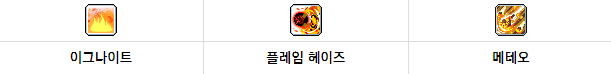

# 불독의 코어강화

## 강화코어

**추천: 2중 6코**

1. 1순위 강화코어

   

   1. **텔레포트 마스터리/포이즌 리전** (전이)
   2. **플레임 스윕** (마비)
   3. **미스트 이럽션** (침투)

2. 2순위 강화코어

   

   1. **이그나이트** (점화)
   2. **플레임 헤이즈** (아지랑이)
   3. **메테오** (운석)

3. 3순위 강화코어

   

   1. **파이어 오라** (화염)
   2. **메기도 플레임** (묵시록)
   3. **이프리트** (마신)

## 스킬코어

### 전용 스킬 코어

1. 도트 퍼니셔 - 화염구슬, 도트 중첩 기준 갯수, 보스 우선 타격
1. 포이즌 체인 - 독 전이, 점유율 높음, 원킬컷 높은 편
1. 포이즌 노바 - 독구름, 폭파 가능
1. 퓨리 오브 이프리트 - 90초 엔버링크에 맞춰 사용, 퍼번트 5스택 유지 필수

### 특화 스킬 코어

1. 언스태이블 메모라이즈 - 인피 무한지속을 위해 1순위
1. 메이플 여신의 축복
1. 오버로드 마나 - 최종 데미지
1. 에테리얼 폼 - 생존기

### 공용 스킬 코어

1. 에르다 노바 (바인드)
1. 블링크 (체공)
1. 에르다의 의지 (상태이상 저항)
1. 쓸만한 홀리 심볼 (경험치, 드랍)
1. 쓸만한 샤프 아이즈 (크리티컬 확률/데미지)
1. 쓸만한 컴뱃 오더스 (인피니티 +1s)
1. 쓸만한 어드밴스드 블레스 (마력 +20)
1. 스파이더 인 미러 (보조 딜링)
1. ~~크레스트 오브 더 솔라~~